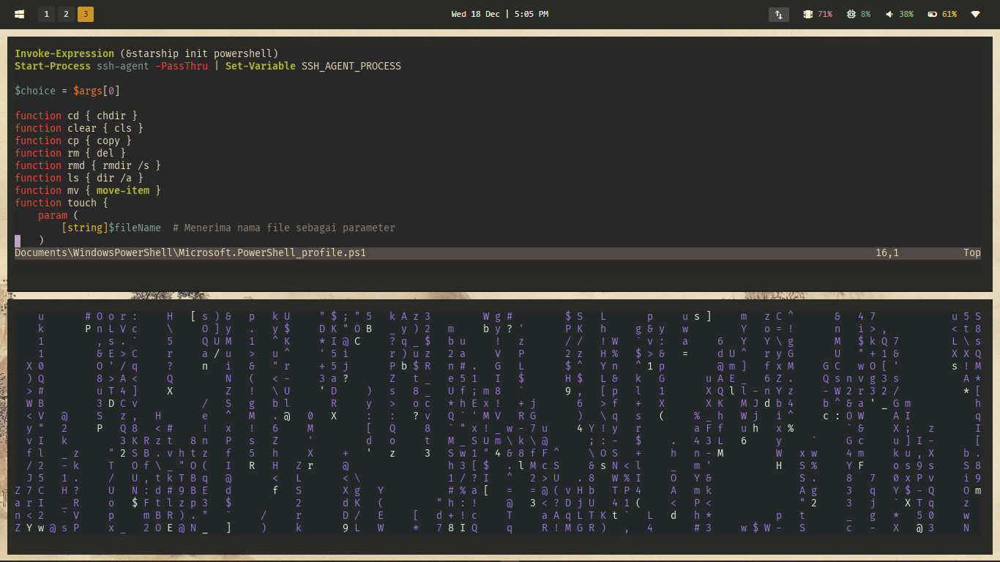

  

# Veillain's Windows10 Dotfiles

> All the configuration used to create my Workflow Environment > [Screenshots](#screenshots)

## Contents

- [Screenshots](#screenshots)
- [Installation](#installation)

## Screenshots

  
More Screenshots

  #### Desktop
  
  

  #### Discord
  

  #### Spotify
  

## Installation

  
Dependencies

  ### System Dependencies
  - Git
  - ArchWSL (Very Optional)
  - Node.JS
  - Npm
  - Python

  ### Main Dependencies
  - GlazeWM                     - Dynamic Window Manager
  - Zebar                       - Status Bar
  - PowerToys                   - Powertoys Run
  - StartIsBack                 - Taskbar & Startmenu
  - Ultra UX Theme Patcher      - Custom Theme for Windows
  - Se7en Theme Source Patcher  - Custom Icon for Windows
  - ZoomIt                      - Zoom In & Out with Bindings
  - NeoVim                      - Text & Code Editor
  - WezTerm                     - Terminal

  ### Optional Dependencies
  - Discord
  - Better Discord
  - Spotify
  - Spicetify
  - Google Chrome
  - Stylus (Browser Extension)

## Steps to Install / Apply

### 1. Install all the [Dependencies}(#dependencies)
### 2. 
